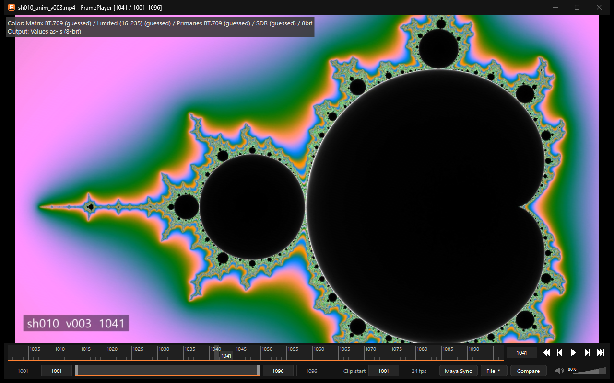

色の扱い
========

FramePlayer は、動画に記録された色の情報を読み、味付けをせずに規格どおりの色で表示します(ニュートラル)。
ニュートラルとは、**エンコードする前の画像と同じ値が画面に出る**\ ことです。Maya のプレイブラストなら、
Maya のビューポートと同じ色になります。

変換の式は規格(ITU-R BT.601・709・2020・2100・BT.2390・BT.2408、ITU-T H.273、IEC 61966-2-1、SMPTE RP 177)から作りました。

色の情報の表示
--------------

右クリックのメニューの「Show Color Info」で、映像の左上に、使っている色の解釈と出し方を表示します。

   色の情報の表示。推定した項目には「(guessed)」、手動で指定した項目には「(manual)」と付きます。

読み取る色の情報
----------------

.. list-table::
   :header-rows: 1
   :widths: 25 75

   * - 項目
     - 内容
   * - YUV の行列
     - BT.601・BT.709・BT.2020・SMPTE 240M・FCC
   * - 範囲
     - 映像用(8bit なら 16〜235)・全範囲(0〜255)
   * - 色域
     - BT.709(sRGB)・BT.601 の 525本 / 625本・BT.2020・Display P3・DCI-P3(EXR は ACES も)
   * - 伝達関数
     - SDR(BT.709・sRGB・ガンマなど)・リニア・HDR の PQ・HLG
   * - その他
     - ビット数(8・10)、色の画素の位置、HDR の最大の明るさ(MaxCLL・マスタリング)

動画に色の指定が無いときは、一般的なプレイヤーと同じ決まりで推定します。HD 以上(幅 1024 超か高さ 576 超)は BT.709、
それ未満は BT.601 です。範囲は映像用、伝達関数は SDR とします。

表示の仕方
----------

* **SDR・BT.709 の 8bit の動画**: YUV から RGB へ戻した値を、そのまま 8bit で画面へ出します(値が1段も変わりません)。
* **色域が違う SDR の動画**\ (BT.2020・P3・SD の BT.601): BT.709 の同じ色へ変換して出します。
* **10bit の動画**: 10bit のまま変換し、8bit に落とさずに画面へ出します。
* **HDR の動画を HDR の画面で**: 明るさ(cd/m²)をそのまま出します。
* **HDR の動画を SDR の画面で**: BT.2390 の曲線で、動画の最大の明るさを基準の白(203cd/m²、BT.2408)までに収めます。
* 拡大は双三次補間(等倍なら元の値のまま)、縮小はミップマップを使います。
* Windows の映像処理と、GPU のドライバーの映像の補正(コントラストの強調など)は通しません。

色の解釈を手動で直す
--------------------

動画の色の情報が誤っている(または付いていない)ときは、右クリックのメニューの「Color Interpretation」で直します。

* 「YUV Matrix」「Range」「Primaries」「Transfer Function」を、それぞれ「Auto」(動画の指定・推定のまま)か手動の値にします。
* 「Reset All Overrides」で、すべて自動に戻します。
* 比較中は、1本目と2本目を別々に指定できます。
* 手動の指定は、開いている間だけ有効です(開き直すと自動に戻ります)。

使わないもの
------------

* ICC プロファイル・OCIO・LUT は使いません。広い色域の画面では、Windows の自動の色管理に任せます。
* 読み込みを待つ間の仮の縮小画像は、色の精度を落として持っています(正式なコマが届けば置き換わります)。
