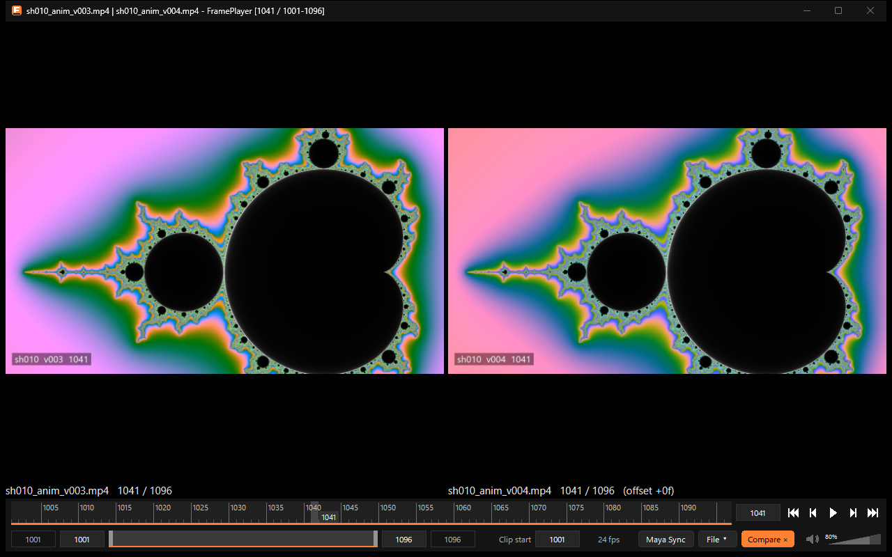

2本の比較
=========

2本の動画を左右に並べ、同じコマ番号で表示します。テイク違いやバージョン違いの見比べに使います。

   2本の比較。各表示枠の下に、ファイル名・コマ番号・右のずらし(offset)を表示します。

2本目を開く
-----------

次のどれかで開きます。

* 1本目を開いた状態で、映像の右半分へドラッグ&ドロップする(左半分なら1本目の差し替え)。
* 2つのファイルをまとめてドロップする(1つ目が左、2つ目が右)。
* 操作部の「Compare」ボタン、または Ctrl+Shift+O でファイルを選ぶ。
* コマンドラインで ``FramePlayer.exe 左.mp4 右.mp4`` と指定する。

比較中は「Compare」ボタンが「Compare ×」(オレンジ)になります。押すと比較をやめます。

見比べ方
--------

* 2本は同じコマ番号で表示します。フレームレートが違っても、番号で合わせます。
* スライダー・再生・コマ送りは左の動画で操作し、右はそれに従います。再生中は、左右両方のコマがそろってから進めます。
* 右だけをずらすには、[ / ] を押します(Shift と一緒なら10コマずつ)。右の映像の上の中ボタンドラッグでもずらせます。
* 左の映像の上の中ボタンドラッグでは、左だけを動かします(右の表示はそのまま)。
* ずらした結果が右の動画の外になるときは、「Out of range」と表示します。
* 比較中は音声を鳴らしません。読み込みのキャッシュは2本で半分ずつ使います。
* 色の解釈の指定(:doc:`color`)は、右クリックのメニューで1本目と2本目を別々に指定できます。
