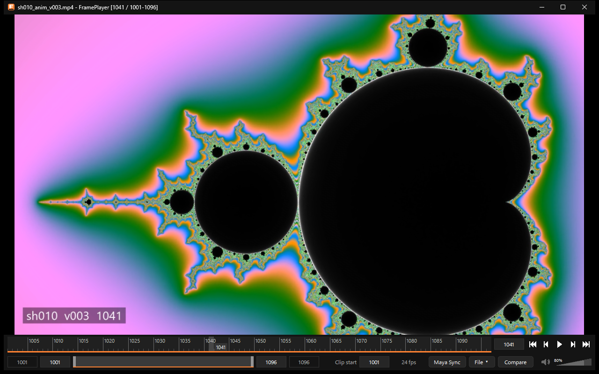

FramePlayer ドキュメント
========================

FramePlayer は、コマ送りと2本並べての比較に特化した Windows 用の動画プレイヤーです。
アニメーションのチェックに使うことを考えて作っており、Maya のタイムスライダーと双方向に連携できます。

   FramePlayer の画面。映像の下に、Maya と同じ並びのタイムスライダー(上段)とレンジスライダー(下段)があります。

.. list-table::
   :widths: 30 70

   * - 対応 OS
     - Windows 10・11(64bit)
   * - 開けるもの
     - 動画(mp4・mov・mkv・avi・webm など)と連番画像(png・jpg・tif・exr など)
   * - Maya との連携
     - Maya 2022〜2027。タイムスライダーの現在のフレーム・再生範囲・再生を合わせます
   * - 必要なもの
     - 本体の exe だけ(Windows の標準の機能だけを使い、追加のライブラリは要りません)
   * - 現在の版
     - |release|

特長
----

* **コマ番号が正確**: 開いたときに全コマの目次を作り、どこから読んでもコマ番号がずれません。
  可変フレームレートの動画も、本来の時刻のまま扱います。
* **軽くて速い**: デコードと縮小は GPU で行い、先のコマを裏で読んでおきます。Maya や Unreal Engine と同時に
  使っても邪魔にならないよう、メモリと CPU の使用を抑えています。
* **Maya と同じ操作**: タイムスライダー・レンジスライダーの形とキー操作(←→・Alt+V・I/O など)が Maya と同じです。
* **2本の比較**: 2本を左右に並べ、同じコマ番号で表示します。片方だけずらすこともできます。
* **ニュートラルな色**: 動画に記録された色の情報を読み、味付けをせずに規格どおりの色で表示します。HDR と 10bit にも対応します。
* **連番画像**: 1枚を開くと連番を探して、動画と同じように扱います。OpenEXR も読めます。

.. toctree::
   :maxdepth: 2
   :caption: はじめに

   install
   usage

.. toctree::
   :maxdepth: 2
   :caption: 機能

   compare
   sequences
   maya
   color

.. toctree::
   :maxdepth: 2
   :caption: リファレンス

   shortcuts
   formats
   settings
   limitations

.. toctree::
   :maxdepth: 2
   :caption: 開発・その他

   development
   changelog

読む順番の目安
--------------

* はじめて使う: :doc:`install` → :doc:`usage` → :doc:`shortcuts`
* 2本を見比べたい: :doc:`compare`
* 連番画像・EXR を見たい: :doc:`sequences`
* Maya のタイムスライダーと合わせたい: :doc:`maya`
* 開けない形式がある: :doc:`formats`
* 色が他のソフトと違って見える: :doc:`color`
