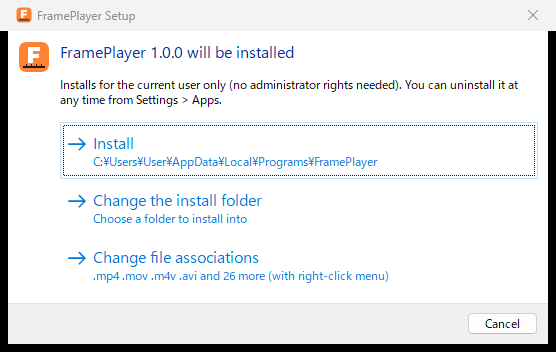
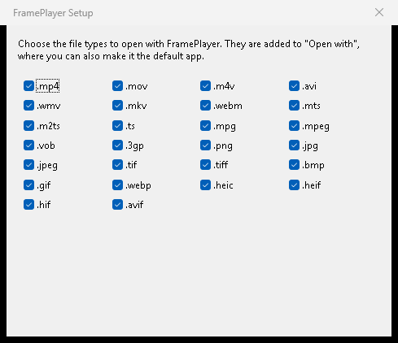

インストール
============

FramePlayer は、セットアップ(``FramePlayerSetup.exe``)で入れるか、本体の ``FramePlayer.exe`` をそのまま使います。
どちらも管理者の権限は要りません。

セットアップで入れる
--------------------

``FramePlayerSetup.exe`` を実行し、「Install」を押します。

   セットアップの最初の画面。そのまま「Install」を押せば入ります。

* インストール先は ``%LOCALAPPDATA%\Programs\FramePlayer`` です(このユーザーだけに入れます)。
  「Change the install folder」で変えられます。
* スタートメニューに追加し、設定の「アプリ」の一覧に載ります。アンインストールもそこから行えます。
* Maya との連携に使うスクリプトも一緒に入ります(:doc:`maya`)。
* 同じセットアップをもう一度実行すると、入れ直し(または更新)になります。前回の関連付けの選択は引き継ぎます。

ファイルの関連付け
~~~~~~~~~~~~~~~~~~

「Change file associations」で、FramePlayer で開くファイルの種類を選べます(既定はすべて)。

   関連付ける拡張子の選択。右クリックのメニューに「Open with FramePlayer」を出すかも選べます。

* 選んだ種類は、ファイルを右クリックしたときの「プログラムから開く」の候補に FramePlayer が出るようになります。
* 開くのに Windows の拡張機能が要る種類(webm・webp・heic・avif・jxl)は、その拡張機能が入っているときだけ選べます。
  入っていない種類は灰色になり、関連付けません(:doc:`formats`)。拡張機能を入れた後にセットアップを入れ直すと選べます。

いつも FramePlayer で開くには
~~~~~~~~~~~~~~~~~~~~~~~~~~~~~

Windows の決まりで、アプリが自分を「既定のアプリ」にすることはできません。ファイルを右クリックして
「プログラムから開く」→「別のプログラムを選択」で FramePlayer を選び、「常に使う」を押してください(拡張子ごと)。

アンインストール
~~~~~~~~~~~~~~~~

設定の「アプリ」から FramePlayer をアンインストールします。「Also delete settings and other data」を選ぶと、
音量や最近使ったファイルなどの設定と、Maya との連携の鍵も消します。

画面を出さずに入れる
~~~~~~~~~~~~~~~~~~~~

まとめて配るときは、画面を出さずに入れられます。

.. code-block:: bat

   rem すべての種類を関連付けて入れる
   FramePlayerSetup.exe /S
   rem 関連付ける拡張子を選んで入れる
   FramePlayerSetup.exe /S --extensions .mp4;.mov
   rem 関連付けをせずに入れる
   FramePlayerSetup.exe /S --no-file-types
   rem アンインストールする
   "%LOCALAPPDATA%\Programs\FramePlayer\Uninstall.exe" --uninstall /S

``FramePlayerSetup.exe --check-file-types`` は、拡張子ごとに必要な拡張機能が入っているかを調べて書き出すだけで、何も変えません。

exe をそのまま使う
------------------

``FramePlayer.exe`` は1つのファイルで動きます。好きな場所に置いて実行してください。
設定は ``HKEY_CURRENT_USER\Software\FramePlayer`` に保存します(:doc:`settings`)。

Maya と連携するときは、``FramePlayer.exe`` と同じフォルダーに ``maya`` と ``python`` のフォルダーも置いてください
(配布用のフォルダーの並びのまま使います。:doc:`maya`)。
