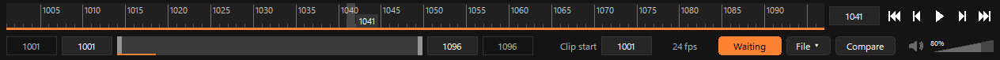

Maya との連携
=============

FramePlayer は、Maya のタイムスライダーと双方向に連携できます。

* Maya で時間を動かす(スクラブ・再生・キー操作)と、FramePlayer が同じフレームを表示します。
* FramePlayer でコマ送り・スライダー操作・再生をすると、Maya の時間が追従します。
  Maya のシーンが重くても、最新のフレームだけを反映するので遅れは積み重なりません。
* 再生範囲も合わせられます。
* フレーム番号の対応は「FramePlayer の番号 = Maya の番号 × 倍率 + オフセット」です。

Maya 側の準備
-------------

Maya 側では、FramePlayer に付いている連携パネルを使います。Maya の設定(``Maya.env`` やモジュール)を変える必要はありません。

FramePlayer だけを入れた場合
~~~~~~~~~~~~~~~~~~~~~~~~~~~~

インストール先(またはダウンロードした FramePlayer のフォルダー)の ``maya\FramePlayerMayaSync.py`` を、Maya のビューへ
ドラッグ&ドロップします。

* 連携パネルが開き、今のシェルフに「FramePlayer」のボタンが追加されます。次からはこのボタンで開けます。
* スクリプトエディターの File > Source Script でこのファイルを実行しても開けます(シェルフのボタンは追加しません)。
* インストール先の既定は ``%LOCALAPPDATA%\Programs\FramePlayer`` です。
* このスクリプトは、同じフォルダーの並びにある ``python\frameplayer``(連携パネルの本体)を読み込みます。
  フォルダーの並びを変えた場合は、環境変数 ``FRAMEPLAYER_HOME`` に FramePlayer のフォルダーを指定してください。

.. code-block:: text

   FramePlayer\
   ├ FramePlayer.exe
   ├ maya\FramePlayerMayaSync.py    Maya へドラッグ&ドロップするスクリプト
   └ python\frameplayer\            連携パネルの本体

MayaHTools を使っている場合
~~~~~~~~~~~~~~~~~~~~~~~~~~~

HTools メニューの animation > framePlayerSync を選びます。スクリプトからは ``import frameplayer; frameplayer.show()`` で開けます。

連携の始め方
------------

1. 連携パネルの「Launch FramePlayer」を押します。FramePlayer が連携モードで起動し、自動でつながります。
2. FramePlayer をすでに開いている場合は、FramePlayer の操作部の「Maya Sync」ボタンを押してから、パネルの「Connect」を押します。
3. つながると、パネルの上の表示が「Connected」になり、FramePlayer のボタンが「Synced」になります。

   連携モードの FramePlayer。Maya からの接続を待っている間は「Waiting」、つながると「Synced」と表示します。

.. list-table:: FramePlayer の「Maya Sync」ボタン
   :header-rows: 1
   :widths: 30 70

   * - 表示
     - 状態
   * - Maya Sync
     - 通常のモード。ポートを開いていません
   * - Waiting(オレンジ)
     - 連携モード。この PC の中からの接続を待っています
   * - Synced(オレンジ)
     - 連携モード。Maya とつながっています(ウィンドウのタイトルにも「Synced」と出ます)

もう一度押すと、接続を切って通常のモードに戻ります。連携モードは保存せず、起動したときはいつも通常のモードです
(Maya の「Launch FramePlayer」から起動したときだけ連携モードで始まります)。

連携パネルの項目
----------------

.. list-table::
   :header-rows: 1
   :widths: 35 65

   * - 項目
     - 内容
   * - Connect / Disconnect
     - FramePlayer につなぐ / 切る
   * - Launch FramePlayer
     - FramePlayer を連携モードで起動して、つなぐ
   * - Port
     - 接続先のポートの番号(既定は 7010。FramePlayer の設定 ``SyncPort`` と合わせます)
   * - Offset [f] (FramePlayer - Maya)
     - FramePlayer のフレーム番号から Maya のフレーム番号を引いた差
   * - Rate (FramePlayer / Maya)
     - フレームレートの比(Maya が 24fps で動画が 48fps なら 2)
   * - Maya → FramePlayer / FramePlayer → Maya
     - それぞれの向きに時間を伝えるか
   * - Sync the playback range
     - 再生範囲も合わせるか
   * - Play in FramePlayer / Stop
     - FramePlayer の再生を Maya から操作する

設定は Maya の設定(optionVar)に保存され、次回も使います。

スクリプトから使う
------------------

.. code-block:: python

   import frameplayer

   # 連携モードで起動する(2つ渡すと比較。sync=False なら通常のモード)
   frameplayer.launch(r"D:\shots\sh010.mp4")

   sync = frameplayer.connect(offset=0, multiplier=1.0, sync_range=True)
   if sync is None:
       print(frameplayer.last_error())   # つながらなかった理由
   else:
       sync.play()
   frameplayer.disconnect()

Maya から起動する ``FramePlayer.exe`` は、環境変数 ``FRAMEPLAYER_EXE`` → パッケージの中の ``FramePlayer.exe`` →
インストーラーで入れた FramePlayer の順に探します。

安全のための仕組み
------------------

* **ふだんはポートを開きません**: 連携モードのときだけ、この PC の中(127.0.0.1)からだけ接続できる口を開きます。
  ほかの PC からはつなげません。Maya 側でポート(commandPort)を開く必要もありません。
* **互いに確かめます**: ユーザーごとの秘密の鍵(``%LOCALAPPDATA%\FramePlayer\sync.key``)を使い、接続のたびに
  相手が同じ鍵を持っているかを確かめます(HMAC-SHA256)。鍵そのものは通信に流しません。正しく応えない相手の命令は受け付けません。
* **できることは限られています**: 連携でできるのは、フレーム・再生範囲・再生/停止だけです。ファイルを開いたり、
  プログラムを動かしたりする命令はありません。

同期の遅れの目安
----------------

通信そのものは 0.1ms 前後です。遅れのほとんどは Maya のシーンの計算と、読み込み済みでないコマのデコードです。

.. list-table::
   :header-rows: 1
   :widths: 46 18 18 18

   * - 項目
     - 空のシーン・24fps
     - 重いシーン・24fps
     - 重いシーン・60fps
   * - Maya でコマ送り → FramePlayer の表示
     - 1.5ms
     - 1.4ms
     - 1.5ms
   * - FramePlayer でコマ送り → Maya の反映
     - 5.9ms
     - 26ms
     - 35ms
   * - FramePlayer の再生 → Maya の追従
     - 遅れ 0f
     - 遅れ 0f
     - 遅れ最大 2f

測定環境: Core i7-12700KF、GeForce RTX 3090 Ti、Maya 2026、720p の動画。重いシーンは約173万面の球30個を毎フレーム変形させたものです。
