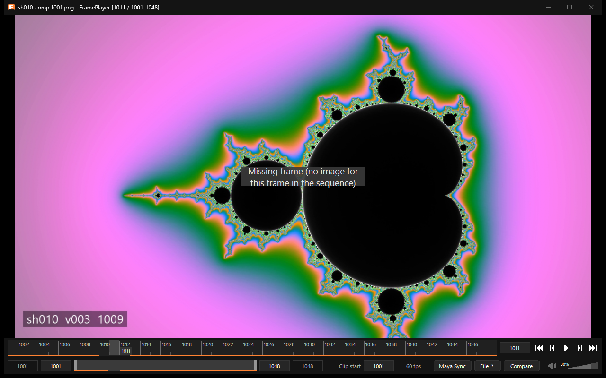

連番画像
========

連番画像(``shot.1001.exr``〜``shot.1048.exr`` のように、番号の部分だけが違う画像)を、動画と同じように
コマ送り・再生・比較できます。

   連番画像。欠けたコマ(この例では 1010〜1012)では直前の画像を出し、「Missing frame」と表示します。
   タイムスライダーの下端の帯も、欠けた所で途切れます。

開き方
------

連番の中のどれか1枚をドラッグ&ドロップするか、「File」→「Open...」で選びます。同じフォルダーから同じ名前の並びを探して、
まとめて開きます。

* 番号は、拡張子の直前にある最後の数字の並び(9桁まで)です。``0001`` のような桁の揃えの有無は問いません。
  大文字・小文字の違いは同じ名前として扱います。
* 番号の無い画像は、1枚だけの連番として開きます。
* タイムラインの開始は、最初のファイルの番号になります(連番を開いている間だけ。動画の Clip start の設定は変えません)。
* 番号の抜け(欠け)は詰めずに、そのコマを空けておきます。

フレームレート
--------------

画像にはフレームレートが書かれていないので、既定は 60fps です。連番を開いているときに操作部のフレームレートの欄
(「60 fps」の所)をクリックすると、値を入力して変えられます(1〜1000)。変えた値は次の連番にも使います。

対応形式
--------

.. list-table::
   :header-rows: 1
   :widths: 35 25 40

   * - 形式
     - 読み方
     - 必要なもの
   * - PNG・JPEG・TIFF・BMP・GIF・JPEG XR(jxr・wdp)
     - Windows の画像の機能(WIC)
     - Windows 標準
   * - WebP
     - WIC
     - Webp Image Extensions(多くの PC に最初から入っています)
   * - HEIF(heic・heif・hif)
     - WIC
     - HEIF Image Extensions と HEVC Video Extensions
   * - AVIF
     - WIC
     - AV1 Video Extension(と HEIF Image Extensions)
   * - JPEG XL
     - WIC
     - JPEG XL Image Extension
   * - OpenEXR
     - FramePlayer が自分で読む
     - なし

拡張機能は Microsoft Store から無料で入れられます。

* 8bit の画像は 8bit のまま、16bit の PNG・TIFF は 16bit のまま、浮動小数点の画像(EXR など)は半精度のまま扱い、
  表示のときに色を変換します。
* EXR と浮動小数点の画像はリニア(1.0 が SDR の白)、それ以外は sRGB として扱います。1 を超える値は、HDR の画面では
  そのまま、SDR の画面では切って表示します。
* 音声はありません。

OpenEXR
-------

OpenEXR は、外部のライブラリを使わず FramePlayer が自分で読みます(OpenEXR のファイル形式の仕様から作りました)。

.. list-table::
   :widths: 30 70

   * - 圧縮
     - NONE・RLE・ZIPS・ZIP・PIZ・PXR24・B44・B44A・DWAA・DWAB(すべて)
   * - 画素の型
     - half・float・uint
   * - 形
     - 走査線とタイル(いちばん細かい段)、マルチパート(最初の部分)
   * - チャンネル
     - R・G・B・A。無ければ最初の層の「層の名前.R」など、それも無ければ Y(灰色で表示)
   * - 色域
     - ``chromaticities`` から BT.709・BT.2020・Display P3・DCI-P3・ACES(AP0)・ACEScg(AP1)を見分け、
       画面の色域に変換して表示します。書かれていなければ BT.709 として扱います
   * - その他
     - 画素の縦横比(``pixelAspectRatio``)、表示の範囲(displayWindow)とデータの範囲(dataWindow)

* 読めないもの: 深いデータ(deep)、縦横に間引いたチャンネル、2つ目以降の部分や層の切り替え。
* 読み込みの速さの目安(4K・半精度の RGB): 1枚あたり約 60ms。1枚の中も並行して読むので、CPU のコアが多いほど速くなります。
  一度読んだコマはキャッシュから即座に出ます。

読み込みの仕組み
----------------

* 画像は裏で、先のコマまで並行して読みます(CPU のコア数の半分まで、最大8枚)。
* 遠くへ飛んだ直後は、表示するコマを先に仕上げ、順に進むにつれて先読みを増やします。
