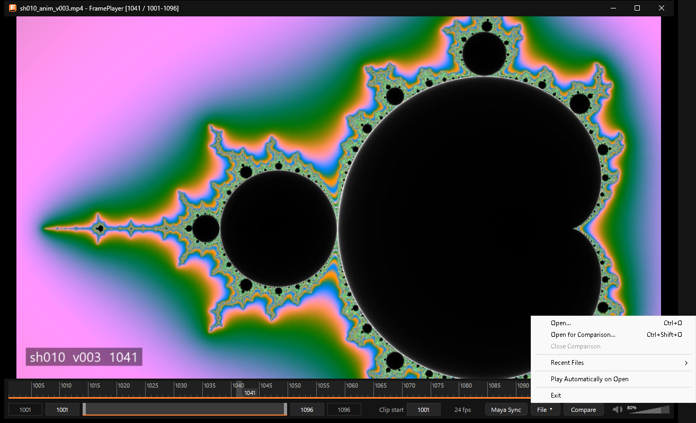
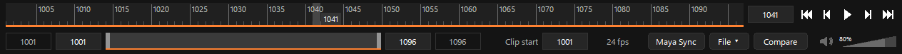
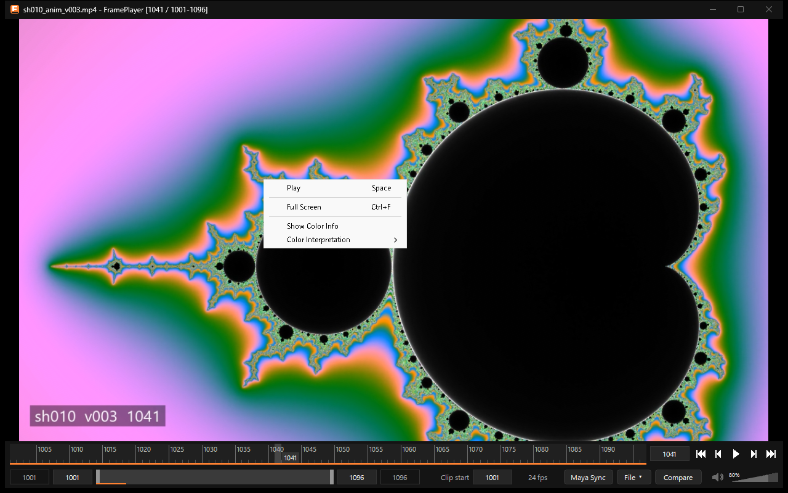

使い方
======

開く
----

次のどれかで開きます。

* 動画(または連番画像の1枚)をウィンドウへドラッグ&ドロップする。
* 操作部の「File」ボタン →「Open...」(Ctrl+O)で選ぶ。
* 関連付けた種類のファイルをダブルクリックする(:doc:`install`)。
* コマンドラインで ``FramePlayer.exe <動画>`` と指定する。

開くとすぐに再生します(「File」→「Play Automatically on Open」で切り替えられます)。

   「File」ボタンのメニュー。最近開いたファイル(最大8つ)もここから開けます。

.. list-table:: 「File」ボタンのメニュー
   :header-rows: 1
   :widths: 35 65

   * - 項目
     - 内容
   * - Open... (Ctrl+O)
     - ファイル選択画面で動画(または連番の1枚)を選んで開く
   * - Open for Comparison... (Ctrl+Shift+O)
     - 2本目の動画を選び、右に並べて比較する(:doc:`compare`)
   * - Close Comparison
     - 比較をやめて1本だけ表示する
   * - Recent Files
     - 最近開いたファイル。選ぶと開きます。「Clear List」で一覧を消せます
   * - Play Automatically on Open
     - 開いたらそのまま再生するか(既定はオン)
   * - Exit
     - FramePlayer を閉じる

画面の見方
----------

映像の下は、Maya と同じく「タイムスライダー」と「レンジスライダー」の2段です。

   操作部。上段がタイムスライダー、下段がレンジスライダーとボタンです。

タイムスライダー(上段)
~~~~~~~~~~~~~~~~~~~~~~~

* 再生範囲を目盛りで表示します。どこをクリック・ドラッグしても、そのフレームへ移動します。
* 現在のフレームは、明るい区画と番号の箱で示します。下端のオレンジの帯は、読み込み済み(キャッシュ済み)のコマです。
* 右側は、現在のフレームの欄(押すと番号を入力できます)と、範囲の最初へ・1コマ戻る・再生/停止・1コマ進む・範囲の最後へのボタンです。

レンジスライダー(下段)
~~~~~~~~~~~~~~~~~~~~~~~

* 左から「全体範囲の最初」「再生範囲の最初」、バー、「再生範囲の最後」「全体範囲の最後」の欄です。
  4つとも押すと番号を入力できます(Enter で確定、Esc で取り消し)。
* バーの全体が全体範囲で、明るい部分が再生範囲です。両端のつまみで範囲の端を、中をドラッグすると長さを保ったまま範囲を動かせます。
  ダブルクリックで、全体範囲と直前の再生範囲を切り替えます(Maya と同じ)。
* 右側は、「Clip start」の欄、フレームレート、「Maya Sync」「File」「Compare」のボタン、消音のボタンと音量です。

操作部の部品にマウスを乗せると、説明とショートカットキーが出ます。

コマ送りと再生
--------------

* ←/→ で1コマ、Shift+←/→ で10コマ動きます。再生範囲の端では反対の端へ回り込みます(Maya と同じ)。
* Space(または Alt+V)で再生/停止します。再生は再生範囲の中で繰り返します。
* K を押しながら映像の上を左ドラッグすると、フレームを動かせます(Maya と同じ)。映像の上の中ボタンドラッグでも動かせます。
* 再生は時間どおりに進めることを優先します。読み込みが間に合わないときは、今のコマを表示したまま待ちます。
* 読み込み済みでない位置へ飛ぶと、近いキーフレームの縮小画像に「Loading…」と重ねて仮に表示し、届いたら置き換えます。

キー操作の一覧は :doc:`shortcuts` を見てください。

フレーム番号とタイムライン
--------------------------

フレーム番号の考え方は Maya と同じです。タイムラインは動画の長さに縛られず、範囲や現在のフレームを自由に決められます。

* **Clip start**: 動画の1コマ目を置くフレーム番号です(既定は1)。たとえば 1001 にすると、動画の1コマ目が 1001 になります。
  タイムラインの範囲はそのままで、動画だけが動きます。次回も同じ値を使います。
* 動画の外のフレームでは、映像の代わりに「Out of range」と、動画のある範囲(例: Video: 1001-1096)を表示します。
* 動画を開くと、全体範囲と再生範囲は動画のある所になります。
* 連番画像では、最初のファイルの番号が自動で開始になります(:doc:`sequences`)。

右クリックのメニュー
--------------------

映像の上で右クリックすると、再生/停止・フルスクリーン・色の情報の表示・色の解釈の指定のメニューが出ます。

   映像の上の右クリックのメニュー。

* **Full Screen**\ (Ctrl+F・映像のダブルクリック): モニター全体に広げます。Esc で戻ります。
* **Show Color Info**: 映像の左上に、使っている色の解釈を表示します(:doc:`color`)。
* **Color Interpretation**: 動画の色の情報が誤っているときに、手動で直します(:doc:`color`)。

音声
----

* 通常の再生中だけ音声を鳴らします。コマ送りやスライダーの操作では鳴らしません。2本の比較中も鳴らしません。
* 操作部の右のスピーカーのボタン(または M)で消音、三角形のスライダー(または ↑/↓)で音量を変えます。
