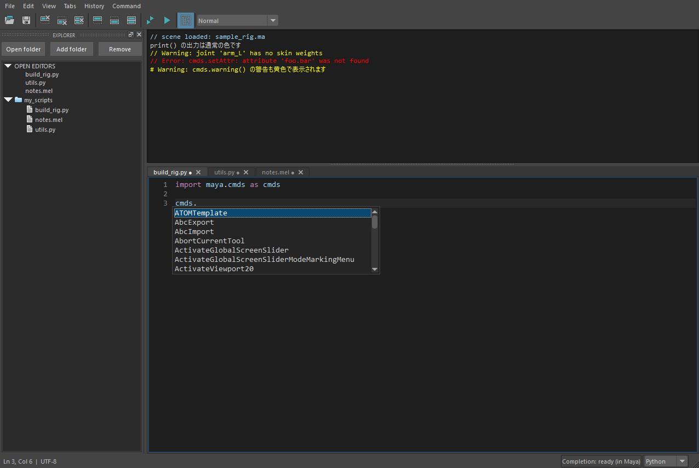
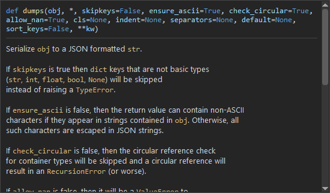
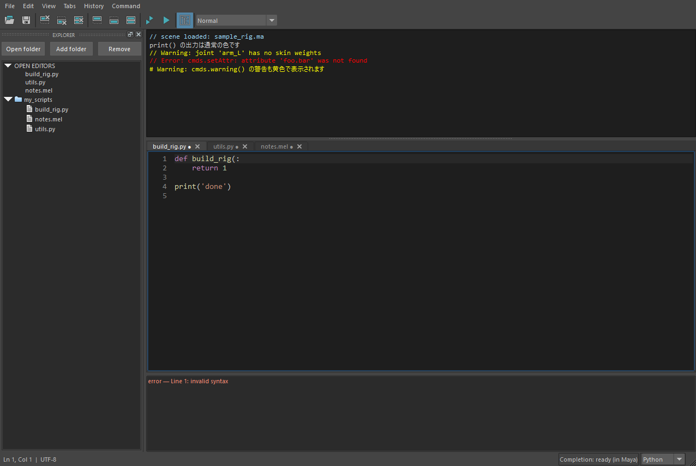
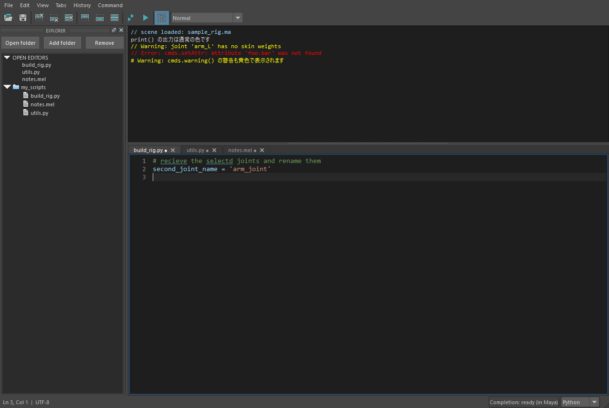

補完・ホバー・静的解析・スペルチェック
======================================

補完の仕組み
------------



   ``cmds.`` の後で Ctrl+Space を押したときの候補一覧。

* 補完は ``hedit.mll`` の中の C++ で行います。入力が止まってから **約 0.25 秒後** に候補を求めます。
  別プロセス・IPC・ワーカーの起動待ちはありません。
* 編集中の本文と、まだ読み込んでいないソースの宣言(``def``\ ・\ ``class``\ ・\ ``import``\ ・代入)は、
  C++ の字句解析で読みます。 **補完のために import も実行もしません。** 5,000 行の本文を編集しながらでも、
  1 回の補完は数ミリ秒で終わります(以前の Python の ``ast`` では約 100 ミリ秒かかっていました)。
* Python に問い合わせるのは、Python でしか分からない情報(読み込み済みのモジュールの今の公開名・
  ``sys.path``\ ・組み込みの名前)だけです(同梱の ``hedit.bridge``\ )。
* ソースの解析結果はキャッシュし、更新日時またはサイズが変わったら再解析します。
  ``sys.path`` の各フォルダーの一覧もキャッシュし、フォルダーの更新日時が変わったら読み直します(確かめるのは 1 秒に 1 回まで)。
  新しく作ったモジュールは最大で約 1 秒後に候補に出ます(**Command → Refresh completion** ならすぐ)。
  読み込み済みの ``maya.cmds`` などは、実在する名前を優先し、検索パスを走査しません。
* Jedi・Pyright など、追加の Python ライブラリは不要です。

補完できるもの
~~~~~~~~~~~~~~

* ``import maya.cmds as cmds`` の別名
* ``from package import Class``
* モジュールの公開名、ソース上のクラスの直接定義メソッド、トップレベルのローカル関数
* ``hlib.ls`` のように、読み込み済みの動的な公開名
* 変数の型を、次の書き方から推論したときのメンバー(カーソルに近い宣言を使う):

  .. code-block:: python

     jnt = hlib.nodes.Joints("spine_IK_jnt")   # クラスの呼出しの結果を代入
     jnt: hlib.nodes.Joint = something()        # 変数の型ヒント("hlib.nodes.Joint" のような文字列も可)
     def build(jnt: hlib.nodes.Joint): ...      # 引数の型ヒント

  ``jnt.`` で、そのクラスのメソッドと、親クラスから受け継いだメソッドを出します(関数の中の変数も対象)。
  推論できない代入(``jnt = 1``\ ・\ ``jnt = hlib.ls(...)[0]`` など)の方がカーソルに近い場合は推論しません。
* 関数の引数名(候補のツールチップに表示)

更新への追従
~~~~~~~~~~~~

* 次の補完要求のたびに、対象モジュールの現在の公開名と ``sys.path`` を取り直します。
  ``hlib.reload()`` の後や、実行後に増えた import も、Refresh completion なしで反映します。
* 読み込み済みのモジュールは、既知の ``.py`` ファイルだけを更新日時とサイズで確認し、関数・クラスの直接の定義も候補へ反映します。
* ``import xxx`` / ``from xxx`` のトップレベルのパッケージ名は、\ ``sys.path`` の各フォルダーを
  **C++ のスレッド** で走査して集めます(Python の GIL を取らないため、走査中も Maya の画面は止まりません)。
  走査は編集画面を開いた時点で始めるため、最初の Ctrl+Space から、まだ読み込んでいないパッケージも候補に出ます
  (初回の走査が終わっていなければ最大 0.5 秒だけ待ちます)。
* 新しく置いたパッケージは、import の補完のたびに裏で走査し直して反映します(走査の開始は最短 5 秒間隔)。
  走査中は直前の結果で即座に候補を出し、走査が終わった後の補完要求で新しい候補が使えます。
* 編集中の本文に構文エラーがあっても、読める部分の宣言は候補に出します。
  ファイルが書きかけ(括弧や三重引用符が閉じていない)のときは、そのファイルの最後の正常な候補を維持します。
* 解析キャッシュを強制的に作り直したいときは、Command → **Refresh completion** を使います。

.. important::

   **補完候補の更新と、Maya で実行するライブラリの更新は別です。**
   ソースを保存した直後に新しい候補が出ても、実行にはライブラリ自身の reload が必要な場合があります。
   hedit は対象を自動で import・reload しません。

補完の上限
~~~~~~~~~~

* 補完の対象は、カーソルまでの **20 万文字** です。超えるとステータスに「Completion: document limit (200k)」と出て、補完しません。
* 補完は Maya のメインスレッドで行うため、大きなファイルや遅いネットワークパスの解析中は、Maya の操作も待機します。

自動補完の切り替えは :ref:`pref-completeLetters`\ ・\ :ref:`pref-completeDot`\ 、
候補に含める種類は :ref:`pref-includeKeywords`\ ・\ :ref:`pref-includeBuiltins` で設定します。

.. _hover:

名前の説明(ホバー)
------------------



   ``json.dumps`` にマウスを重ねたときの説明。

Python タブで関数・クラス・モジュールの名前にマウスを重ねて 0.5 秒ほど止めると、VS Code と同じく、
上に定義の見出し(``def dumps(obj, *, skipkeys=False, ...)``\ )、下に docstring を出します。
キーボードでは、カーソルを名前に置いて **Ctrl+K → Ctrl+I**\ (Edit → Show hover)で出せます。

* 名前のたどり方は補完と同じです(``import`` の別名・\ ``from X import Y``\ ・クラスのメソッド・編集中の本文の関数)。
  **import も実行もしません。**
* 編集中の本文とまだ読み込んでいない ``.py`` は、C++ の字句解析で docstring を取り出します。
  ソースの無い名前(C の拡張・\ ``maya.cmds``\ ・組み込み関数)は、読み込み済みのモジュールの ``__doc__`` を
  ``vars()`` でたどって読みます(property などの属性の取得で動く処理は実行しません)。
* 見出しはエディターと同じフォントと色、docstring は読みやすい UI のフォントです。Google 形式の ``Args:`` などの見出しは太字、
  引数名と ````code```` の部分はコードの色で表示します。長い docstring は小窓の中でスクロールできます。
* 名前と小窓の外へマウスを動かす・キーを押す・スクロールする・Esc で閉じます。小窓へマウスを移しても閉じません。
* 文字列・コメント・予約語の上、MEL のタブでは出しません。
* Maya の **Help → Popup Help** の設定(オン・オフ)には左右されません(hedit がマウスの動きを見て出します)。

制限:

* 変数の型は、補完と同じく、クラスの呼出しの代入と型ヒントからだけ推論します。\ ``node = hlib.ls()[0]`` の
  ``node.parent`` のように、関数の戻り値を経由した名前には出ません。
* ``maya.cmds`` のコマンドは Python 側に説明がほとんど無いため、見出し(``def ls(...)``\ )だけになることがあります。

.. _signature-help:

引数のヒント
------------

Python タブで関数の呼出しの ``(`` や ``,`` を打つと、カーソルの行の上に関数の見出しを出し、
**今入力している引数を太字と下線** で示します(VS Code と同じ)。下には docstring を出します。
手動では **Ctrl+Shift+Space**\ (Go → Trigger parameter hints)で出せます。

* 見出しはホバーと同じ方法で求めます(import も実行もしません)。
* ``obj.method(`` のようにインスタンスから呼ぶときは、先頭の ``self`` を除きます。クラスの呼出し(``Joint(``\ )は
  ``__init__`` の引数を出します。
* ``radius=`` のように名前で渡している引数は、その名前の引数を強調します。\ ``*args`` より後ろの位置引数は ``*args``\ 、
  名前の一致しない ``name=`` は ``**kwargs`` を強調します。
* カーソルが呼出しの括弧の外へ出る・Esc・フォーカスが外れると閉じます。

補完の一覧の種類と説明
----------------------

補完の一覧の各行の左に種類のアイコン(``f`` 関数・メソッド、``C`` クラス、``M`` モジュール、``v`` 変数、
``i`` import した名前、``b`` 組み込みの名前、``k`` 予約語)を、右に薄い色で説明(関数の引数など)を出します。
選んでいる候補の見出しと docstring は、一覧の右に小窓で出します(ホバーと同じ内容)。

* 一覧は、補完中の名前の先頭に出します。続けて名前を入力しても一覧は閉じず(ちらつかず)、入力した名前で絞り込みます
  (VS Code と同じ)。前回の候補で足りないとき(名前を短くした・候補が多く上限まで出ていた)は、入力が止まってから
  候補を求め直します。
* ``(``\ ・空白など名前以外を入力する・カーソルを名前の外へ動かすと閉じます。

静的解析
--------

オンにすると、アクティブな Python タブを、Maya 同梱の Python のコンパイラで構文確認します。
詳細は :ref:`pref-staticAnalysis` を参照してください。



   構文エラーを含むコード。問題一覧に行番号付きで表示されます。

* 入力が止まってから 0.8 秒後に解析し、結果は問題一覧に出ます(クリックで該当行へ移動)。
* 構文エラー・インデントエラー・関数外の ``return``\ ・一部の ``SyntaxWarning``\ ・\ **未定義の名前** が対象です。
* 本文にも波線を引きます(エラーは赤、警告は黄色)。マウスを重ねると説明を出し、\ **F8 / Shift+F8** で次 / 前の問題へ移って
  行の下に説明を出します。スクロールバーの右端にも印を出します。
* 型・import 先・Maya API の引数は対象外です。

スペルチェック
--------------

英単語のつづりを、Windows 標準の辞書で確認します。詳細は :ref:`pref-spellCheck` を参照してください。



   つづりの誤り(``recieve`` / ``selectd``)に波線が付きます。

* 画面に見えている範囲(最大 8,000 文字)の 4〜40 文字の英単語だけを検査します。
* ``camelCase`` / ``snake_case`` は分割して検査します。
* Maya・Python の代表的な語は除外していますが、独自の名前は誤検出されることがあります。

参考: `Windows のスペルチェック API <https://learn.microsoft.com/en-us/windows/win32/api/spellcheck/nn-spellcheck-ispellchecker>`_
