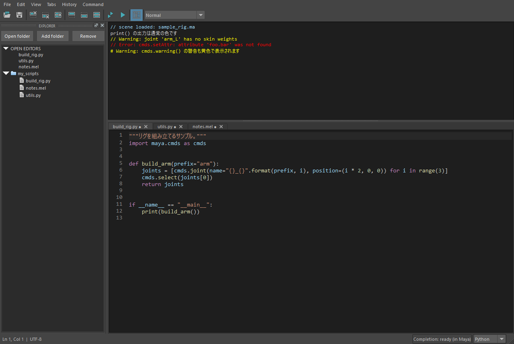

出力欄(Output)
================

出力欄は、Maya が出力した内容を表示する、読み取り専用の領域です。

何が表示されるか
----------------

* hedit で実行したコードの結果・警告・エラー。
* Maya 標準のスクリプトエディター・他のエディター・他のツールが出力した内容。
  hedit は Maya の出力の通知(``MCommandMessage``\ )を購読して表示します(:ref:`output-capture`)。
* 最初に表示するとき、Maya が保持している履歴を **最大 512 Ki 文字** 取り込みます。Maya の起動時の出力も、保持されていれば表示します。
  その後は新しい出力の通知を購読し、初期履歴と重複させません。

.. note::

   * すでに Maya 側で消去された履歴や、別のエディターが独自に持つログは復元できません。
   * **Clear output は hedit の表示だけを消します。** Maya 標準のスクリプトエディターの履歴は消えません。
   * 他のスレッドからの出力は、Maya 自身がメインスレッドで文書に反映するまで遅れる場合があります。
     Maya がまだ出力していない内容は表示できません。

書式
----

Maya 標準のスクリプトエディターと同じ記号・改行で表示します。

* 通常の ``print`` は、そのまま出ます(コメント記号は付きません)。
* 情報通知は各行が ``//``\ (スラッシュ 2 つと空白) で始まります。
* 警告・エラーは ``// Warning:`` / ``// Error:`` で始まり、2 行目以降も ``//`` で始まります。
* Python の例外は ``# Error:`` で始まります。
* 複数行の通知や空行にも同じ書式を適用し、行末に独自の ``//``\ (前に空白を 1 つ置いたもの)は付けません。
* Maya 2022 の Script Editor は書き方が違い(記号は 1 行目だけで、最後に空白を挟んで ``//``\ ・Python は ``#`` を付ける)、
  hedit もその版では同じ書き方にします。

.. _output-capture:

出力の取り込み方と速さ
----------------------

hedit は、Maya の出力の通知の本文を、Maya 標準のスクリプトエディターと同じ形に自分で整えて表示します(既定)。

* 標準のスクリプトエディターと違うのは、Python から呼んだ ``cmds.warning``\ ・\ ``cmds.error`` の先頭が ``# Warning:`` ではなく
  ``// Warning:`` になることだけです(色と種類は同じ)。通知からは MEL の ``warning`` と区別できないためです。
* 完全に同じ記号が必要なら、Preferences の **Exact Script Editor output format (slower)** をオンにします
  (:ref:`pref-exactOutput`)。Maya の非表示の出力欄(reporter)が整形した文字をそのまま使いますが、Maya がその出力欄への
  追記に標準のスクリプトエディターを 1 つ開いているのと同じ時間をかけるため、大量のエラーが出ると遅くなります。
* Maya の処理の途中(ファイルの読み込みなど)も、出力欄を描き直して進み具合を見せます。出力が続くほど間隔を広げます
  (続いた時間が 1 秒未満なら 100ms、3 秒未満なら 500ms、それ以上は 1 秒ごと。処理が終われば元に戻ります)。
* 出力欄に残すのは最新の 5,000 行です。一度に 5,000 行を超える出力が来たときは、表示しきれない古い行は最初から入れません。

参考(Maya 2027、エラー 5,000 件を出して表示し終わるまでの秒数):

.. list-table::
   :header-rows: 1
   :widths: 46 18 18 18

   * - 条件
     - 短い 1 行
     - 長い 1 行
     - 8 行のトレースバック
   * - 標準のスクリプトエディターを表示
     - 1.83
     - 2.47
     - 7.10
   * - hedit を表示(既定)
     - 1.43
     - 2.10
     - 3.91
   * - hedit を表示(Exact Script Editor output format。0.4.0 までと同じ)
     - 2.13
     - 3.51
     - 8.54
   * - どちらも表示しない(基準)
     - 1.19
     - 1.55
     - 3.39

標準のスクリプトエディターも開いていると、その分の時間が足されます。

種別ごとの色
------------

   通常の出力・情報・警告・エラーが色分けされます。

Maya が通知する **種別** に従って色を付けます。行頭の文字列から推測しないため、複数行の警告・エラーでも色が保たれ、
続く通常の出力に色が残りません。

.. list-table::
   :header-rows: 1
   :widths: 30 25 45

   * - 種別
     - 色
     - 備考
   * - Warning
     - 黄 ``#ffff00``
     -
   * - Error
     - 赤 ``#ff0000``
     - エラー通知に含まれるトレースバックも含む
   * - Result
     - 緑 ``#b5cea8``
     - Maya が結果として通知した値
   * - Info
     - 水色 ``#9cdcfe``
     -
   * - History
     - グレー ``#a0a0a0``
     - 実行したコードの履歴
   * - Display・通常の print
     - 明るいグレー ``#d4d4d4``
     -

``print("Error: ...")`` や ``print(result)`` の文字列から、エラーや成功を推測することはしません。
独自のロガーが通常出力として送った警告も、通常の色になります。

表示モード
----------

上段のアイコンバーで、表示する種別を切り替えます。保持しているログは、モードを戻すと再び表示されます。

.. list-table::
   :header-rows: 1
   :widths: 30 70

   * - モード
     - 内容
   * - Normal(初期値)
     - すべての種別を表示
   * - Output only
     - 実行したコードの History を除外して表示
   * - Warnings + Errors
     - 警告とエラーだけ
   * - Errors only
     - エラーだけ

* Maya 側の Echo All や、他のエディターの設定は変更しません。
* 初回に取り込む履歴には、警告・エラー・結果の接頭辞以外に種別の情報がないため、
  過去に実行したコードは Output only でも表示される場合があります。

保持の上限
----------

* 保持するログは **約 100 万文字**\ 、表示は最大 **5,000 ブロック(行)** です。
* 上限を超えて破棄した古いログは復元できません。
* Clear output は、すべてのモードの保持ログも消去します。

表示の設定
----------

* 出力欄の行番号: :ref:`pref-outputLineNumbers`\ (初期はオフ)
* 折り返し: :ref:`pref-outputWrap`\ (初期はオフ。横長の行は水平スクロール)
* 文字サイズ: コード欄より 2 px 小さい(標準 12 px)。\ :doc:`preferences` の Zoom で変更
* 配色: 背景 ``#1e1e1e``\ 、通常の文字 ``#d4d4d4``\ (コード欄と同じ Dark+ 系)
* 選択・コピー: マウス / Shift+矢印で選択して Ctrl+C。貼り付けや文字の削除はできません。

更新の頻度
----------

出力が届くと、Maya がイベントループへ戻ったときに出力欄へ反映します(続けて届いている間は 25 ms ごとにまとめます)。
出力が無い間は、出力欄の処理は動きません(0.4 までは 25 ms ごとに見に行っていました)。

Maya の処理の途中(シーンの読み込みなど、イベントループへ戻らない間)は、Maya のメインスレッドからの出力の通知に合わせて、
その場で描き直します(間隔は :ref:`output-capture` を参照)。操作イベントを強制処理する ``processEvents`` は使いません。

* hedit を閉じている(ドックを閉じた・別のタブの後ろにある)間は、出力欄へ描きません。届いた出力は上限付きのキュー
  (1Mi 文字)に貯め、表示したときにまとめて描きます。上限を超えた古い出力は捨て、その旨を 1 行出します。
* :ref:`pref-exactOutput` をオンにしていても、hedit を閉じている間は、通知の本文を hedit が整える速い方式で受け取ります
  (Maya の非表示の出力欄への追記の負担を、閉じている間はかけないため)。表示すると正確な方式へ戻ります。そのため、
  閉じている間に届いた出力だけは、Python から呼んだ ``cmds.warning`` などの先頭が ``//`` になります。
* Maya の終了が始まった時点で、出力欄への取り込みを止めます。終了処理中に出力された内容は表示しません
  (解体中の画面へ描画して Maya が落ちるのを防ぐため)。
