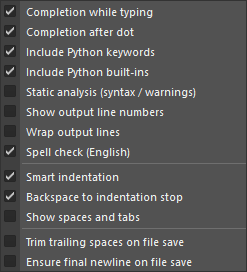
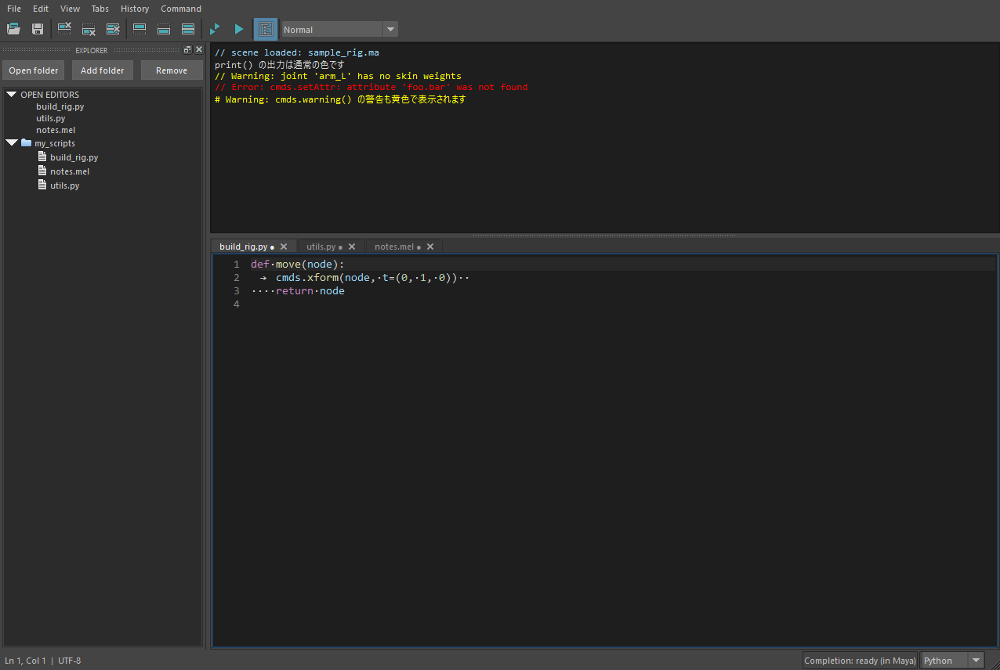

設定(Preferences)
==================

設定は **Edit → Preferences** のサブメニューにあるチェック項目(全部で 13 個)と、
**View** メニューの文字サイズ(Zoom)です。チェックを切り替えると、開いているすべてのタブへ
**その場で反映** し、次回の起動にも引き継ぎます。Maya の再起動は要りません。

   Edit → Preferences のサブメニュー。

.. contents:: このページの内容
   :local:
   :depth: 1

一覧
----

「メニュー表示名」は画面に出る英語の名前、「キー」は保存ファイル(``preferences.ini``)での名前です。

.. list-table::
   :header-rows: 1
   :widths: 27 22 9 42

   * - メニュー表示名
     - キー
     - 初期値
     - 一言でいうと
   * - Completion while typing
     - ``completeLetters``
     - オン
     - 文字を打つと補完候補を自動で出す
   * - Completion after dot
     - ``completeDot``
     - オン
     - ``.`` を打った直後に補完候補を自動で出す
   * - Include Python keywords
     - ``includeKeywords``
     - オン
     - 候補に ``if`` ``for`` ``def`` などの予約語を含める
   * - Include Python built-ins
     - ``includeBuiltins``
     - オン
     - 候補に ``print`` ``len`` などの組み込み名を含める
   * - Static analysis (syntax / warnings)
     - ``staticAnalysis``
     - **オフ**
     - Python の構文エラー・警告を一覧に出す
   * - Show output line numbers
     - ``outputLineNumbers``
     - **オフ**
     - 出力欄の左に行番号を出す
   * - Wrap output lines
     - ``outputWrap``
     - **オフ**
     - 出力欄で長い行を折り返す
   * - Spell check (English)
     - ``spellCheck``
     - オン
     - 英単語のつづり間違いに青い波線を引く
   * - Smart indentation
     - ``smartIndent``
     - オン
     - Enter でインデントを引き継ぐ
   * - Backspace to indentation stop
     - ``backspaceIndent``
     - オン
     - 行頭の空白を Backspace で 4 文字ずつ消す
   * - Show spaces and tabs
     - ``whitespace``
     - **オフ**
     - 空白とタブを目に見える記号で表示する
   * - Trim trailing spaces on file save
     - ``trimWhitespace``
     - **オフ**
     - ファイル保存時に行末の空白を削除する
   * - Ensure final newline on file save
     - ``finalNewline``
     - **オフ**
     - ファイル保存時に末尾の改行を補う

.. note::

   メニューの並びは、補完(4 項目)→ 静的解析 → 出力欄(2 項目)→ スペルチェック →
   区切り線 → インデント・表示(3 項目)→ 区切り線 → 保存時の整形(2 項目)です。
   下の各項目の説明は、この並びの順です。

補完
----

.. _pref-completeLetters:

Completion while typing(``completeLetters``)
~~~~~~~~~~~~~~~~~~~~~~~~~~~~~~~~~~~~~~~~~~~~~~~~

:初期値: オン
:対象: Python タブ(MEL タブでは補完しません)

**何をするか**
   文字(英数字・アンダースコア)を入力して手を止めると、候補の一覧を自動で表示します。
   入力が止まってから約 0.25 秒後に、Maya の中で候補を求めます。

**詳しい動き**
   * 行頭から今のカーソルまでの、英数字・\ ``_`` の並び(接頭辞)が空でないときだけ動きます。
     空白の直後など、接頭辞がまだ無い位置では出ません。
   * ``.`` の直後は、この項目ではなく Completion after dot(次項)の設定に従います。
   * 候補は Enter または Tab で確定します。確定による変更では、次の自動補完を予約しません。
     Enter で確定した後は、次の Enter で改行できます。
   * オフに切り替えた時点で、表示中の候補の一覧は閉じます。

**オフにするとどうなるか**
   文字入力では自動で出なくなります。 **Ctrl+Space による手動の補完は、設定にかかわらず使えます**
   (この項目も Completion after dot もオフのときでも動きます)。

**オフにする目的**
   * 入力中に候補が出るのが邪魔なとき。
   * 大きなファイル・遅いネットワークパスを扱っていて、補完で Maya が一瞬止まるとき。
     補完は Maya のメインスレッドで行うため、解析中は Maya の操作も待機します。

.. _pref-completeDot:

Completion after dot(``completeDot``)
~~~~~~~~~~~~~~~~~~~~~~~~~~~~~~~~~~~~~~~~~

:初期値: オン
:対象: Python タブ

**何をするか**
   ``cmds.`` や ``obj.`` のように ``.`` を入力した直後に、メンバーの候補を自動で表示します。

**詳しい動き**
   * ``.`` の直後は接頭辞が空でも動きます(Completion while typing とは条件が違います)。
   * 候補は現在の ``sys.path`` と読み込み済みモジュールの名前から作ります。未読み込みのソースは、
     import も実行もせずに解析します(:doc:`completion` を参照)。

**オフにするとどうなるか**
   ``.`` を打っても自動では出ません。Ctrl+Space で手動で出せます。

**使い分け**
   ``maya.cmds.`` のように候補が非常に多い名前で、入力のたびに一覧が開くのが煩わしい場合に、
   この項目だけをオフにできます。

.. _pref-includeKeywords:

Include Python keywords(``includeKeywords``)
~~~~~~~~~~~~~~~~~~~~~~~~~~~~~~~~~~~~~~~~~~~~~~~~~

:初期値: オン

**何をするか**
   補完候補に、Python の予約語(``if`` ``for`` ``def`` ``class`` ``import`` ``return`` など)を含めます。

**オフにするとどうなるか**
   候補の一覧から予約語を除きます。関数名・変数名・モジュール名の候補は残ります。

**ポイント**
   候補の表示を絞るだけの設定です。解析の量や速度は変わりません。

.. _pref-includeBuiltins:

Include Python built-ins(``includeBuiltins``)
~~~~~~~~~~~~~~~~~~~~~~~~~~~~~~~~~~~~~~~~~~~~~~~~~~

:初期値: オン

**何をするか**
   補完候補に、Python の組み込み名(``print`` ``len`` ``range`` ``isinstance`` ``dict`` など)を含めます。

**オフにするとどうなるか**
   候補の一覧から組み込み名を除きます。

**使い分け**
   予約語と組み込み名は、頭文字が同じ名前(``p`` で ``pass`` ``print`` ``property`` ...)が多く、
   一覧が長くなりがちです。自作のモジュールや ``maya.cmds`` の名前を探すことが多い場合は、
   この 2 つをオフにすると候補が絞れます。

静的解析
--------

.. _pref-staticAnalysis:

Static analysis (syntax / warnings)(``staticAnalysis``)
~~~~~~~~~~~~~~~~~~~~~~~~~~~~~~~~~~~~~~~~~~~~~~~~~~~~~~~~~~~

:初期値: **オフ**
:対象: **アクティブな Python タブだけ**\ (MEL・非アクティブなタブは解析しません)

**何をするか**
   編集中の Python コードを、Maya 同梱の Python のコンパイラで確認し、構文エラーと一部の警告を
   コード欄の下の **問題一覧** に出します。一覧の項目をクリックすると、該当する行へ移動します。

**詳しい動き**
   * 入力が止まってから **0.8 秒後** に解析します。解析中は「Checking after typing stops…」と表示します。
   * 編集やタブの切り替えで古い診断を消し、あらためて解析します。
   * 対象コードは **実行も import も reload もしません**\ 。外部の解析ライブラリも使いません。
   * 診断の内容は、その Maya が同梱する Python のバージョンに従います。
     たとえば Maya 2022(Python 3.7)では、定数への ``is`` 比較で新しい Python と同じ警告は出ません。

**検出するもの**
   構文エラー、インデントエラー、関数の外の ``return``\ 、一部の ``SyntaxWarning``\ 。
   最初の構文エラーを直すと、次の構文エラーを確認できます。

**検出しないもの**
   型のチェック、未定義の変数、import 先が存在するか、Maya API の引数の検証、
   Pylint 相当の全ルール。 **「エラーが出ない」ことはコードが正しいことを意味しません。**

**性能上の注意**
   Maya と同じプロセスで同期的に解析するため、解析中は短時間 UI が待機します。
   **100 万文字を超える、または 2 万行以上** のコードは解析を省略します(この上限は実行時間の保証ではありません)。
   重いと感じたらオフにしてください。

**関連**
   補完のオン・オフとは独立しています。スペルチェック(:ref:`pref-spellCheck`)とも独立していて、
   スペルチェックは文法を調べません。

出力欄
------

.. _pref-outputLineNumbers:

Show output line numbers(``outputLineNumbers``)
~~~~~~~~~~~~~~~~~~~~~~~~~~~~~~~~~~~~~~~~~~~~~~~~~~~~

:初期値: **オフ**

**何をするか**
   出力欄(Output)の左端に行番号を表示します。

**詳しい動き**
   * 行番号は、桁数・文字サイズ・スクロールに追従します。コピーする本文には含まれません。
   * **Ctrl+G の行移動は、行番号が非表示でも使えます。**
   * 出力を Clear した場合や、表示の上限(5,000 行)を超えて古い行が消えた場合は、
     残っている本文の先頭を 1 行目として数えます。

**コード欄の行番号との違い**
   コード欄の行番号は常に表示し、この設定では切り替えられません。

.. _pref-outputWrap:

Wrap output lines(``outputWrap``)
~~~~~~~~~~~~~~~~~~~~~~~~~~~~~~~~~~~~~~

:初期値: **オフ**\ (折り返さない)

**何をするか**
   オンにすると、出力欄で長い行を画面の幅で折り返します。

**オフのとき**
   折り返さず、横長の行は水平スクロールで読みます。ログの 1 行が長く、行ごとに並べて読みたいときに向いています。

**オンのとき**
   横スクロールなしで全文を読めます。行番号(:ref:`pref-outputLineNumbers`)は論理行(改行ごと)の番号で、
   折り返した続きの行には付きません。

**コード欄の折り返しとの違い**
   この設定は **出力欄だけ\ ** です。コード欄の折り返しは **Alt+Z** で切り替えます(タブごとの一時的な切り替えで、保存しません)。

スペルチェック
--------------

.. _pref-spellCheck:

Spell check (English)(``spellCheck``)
~~~~~~~~~~~~~~~~~~~~~~~~~~~~~~~~~~~~~~~~~

:初期値: オン
:対象: アクティブなタブ(Python / MEL)の **画面に見えている範囲**\ 。出力欄は対象外
:動作環境: Windows(Windows 標準の en-US 辞書を使用)

**何をするか**
   英単語のつづりが辞書にない場合に、その単語へ **青い波線** を引きます(マウスを重ねると「Unknown English word」と表示)。

**詳しい動き**
   * 入力が止まってから **約 0.45 秒後** に、画面に見えている範囲(最大 8,000 文字)だけを検査します。
   * 対象は、コード・コメント・文字列の中の **4〜40 文字の英単語** です。
     ``camelCase`` と ``snake_case`` は語に分けて検査します(``getMatrixValue`` → ``get`` / ``Matrix`` / ``Value``)。
     3 文字以下の語は検査しません。
   * 語ごとに結果をキャッシュします(上限 8,192 語。超えると作り直します)。
   * ``maya`` ``cmds`` ``pymel`` ``hlib`` ``kwargs`` ``getattr`` ``dag`` ``nurbs`` ``blendshape`` など、
     Maya / Python の代表的な語はあらかじめ除外しています。
   * オフにすると、波線と検査待ちの処理を消します。

**利点**
   * 外部の Python ライブラリ・辞書の同梱・オンライン送信が要りません(Windows 標準機能だけを使用)。

**限界(知っておくこと)**
   * 独自の略語や造語(``ctrlGrp`` の ``ctrl`` など)は **誤って検出されることがあります**\ 。
   * 日本語の校正、修正候補の表示、ユーザー辞書、cSpell の設定ファイルの互換性はありません。
   * Windows 標準の辞書が使えない環境では、ステータスバーに
     「English spell-check dictionary is unavailable on this Windows installation」と表示して、何もしません。
   * macOS / Linux では使えません。

**関連**
   静的解析(:ref:`pref-staticAnalysis`)とは独立です。

インデント・表示
----------------

.. _pref-smartIndent:

Smart indentation(``smartIndent``)
~~~~~~~~~~~~~~~~~~~~~~~~~~~~~~~~~~~~~~~

:初期値: オン
:対象: Enter(修飾キーなし)

**何をするか**
   Enter で改行するとき、前の行の **先頭の半角空白をそのまま引き継ぎ**\ 、行末が ``:`` で終わる
   (Python の ``if x:`` や ``def f():`` など)なら **さらに 4 文字分の空白を追加** します。
   MEL タブでは、行末が ``{`` のときに 4 文字を追加します。

**詳しい動き**
   * 引き継ぐのは先頭の半角空白だけです(タブ文字は引き継ぎません)。
   * 行末の判定は、行の前後の空白を除いた最後の文字です。コメントが続く行(``if x:  # メモ``\ )は ``:`` で終わらないため追加しません。
   * インデント幅は **4 空白固定** です。

**オフにするとどうなるか**
   Enter は素直に改行だけを入れます(インデントは付きません)。この設定は Enter キーにだけ働き、貼り付けには影響しません。

.. _pref-backspaceIndent:

Backspace to indentation stop(``backspaceIndent``)
~~~~~~~~~~~~~~~~~~~~~~~~~~~~~~~~~~~~~~~~~~~~~~~~~~~~~~~

:初期値: オン
:対象: Backspace(選択なし・修飾キーなし)

**何をするか**
   行の先頭からカーソルまでが **空白だけ\ ** のとき、Backspace で空白を **1 文字ではなく、
   直前の 4 文字の区切りまで** まとめて削除します。

**例**
   .. list-table::
      :header-rows: 1
      :widths: 40 60

      * - カーソル位置の左の空白
        - Backspace 1 回で削除される数
      * - 8 文字
        - 4 文字(残り 4 文字)
      * - 6 文字
        - 2 文字(残り 4 文字)
      * - 3 文字
        - 3 文字(残り 0 文字)

**動かない場合**
   文字の途中や、空白の後ろに文字があるとき、範囲を選択しているときは、通常の 1 文字削除です。

**オフにするとどうなるか**
   常に 1 文字ずつ削除します。

.. _pref-whitespace:

Show spaces and tabs(``whitespace``)
~~~~~~~~~~~~~~~~~~~~~~~~~~~~~~~~~~~~~~~~~

   オンにすると、空白は ``·``\ 、タブは ``→`` で表示されます。

:初期値: **オフ**

**何をするか**
   半角空白とタブ文字を、目に見える記号で表示します(VS Code の「空白文字を表示」に相当)。
   コード欄のすべてのタブに反映します。

**使いどころ**
   * タブと空白が混ざったインデントを見つけたいとき(Python のインデントエラーの原因調査)。
   * 行末の余計な空白を探すとき(Trim trailing spaces と併用すると分かりやすい)。

**注意**
   表示だけの設定で、本文は変わりません。ファイルへ保存する内容も変わりません。

保存時の整形
------------

以下の 2 つは **明示的なファイル保存(Ctrl+S / Ctrl+Shift+S / File → Save・Save as)のときだけ** 働きます。
Maya 再起動用のタブの自動保存(:doc:`session`)には適用しません(そのため、未保存の本文が勝手に整形されることはありません)。

.. _pref-trimWhitespace:

Trim trailing spaces on file save(``trimWhitespace``)
~~~~~~~~~~~~~~~~~~~~~~~~~~~~~~~~~~~~~~~~~~~~~~~~~~~~~~~~~~~~~

:初期値: **オフ**

**何をするか**
   保存するとき、各行の **行末にある半角空白とタブを削除** します。

**詳しい動き**
   * 保存に成功したときだけ、コード欄の本文にも整形後の内容を反映します。
   * この反映は **1 回のテキスト Undo(Ctrl+Z)で整形前へ戻せます**\ 。
   * 保存に失敗した(書き込めない)場合は、コード欄は変更しません。
   * 行頭のインデントには触れません。空白だけの行は空行になります。

.. _pref-finalNewline:

Ensure final newline on file save(``finalNewline``)
~~~~~~~~~~~~~~~~~~~~~~~~~~~~~~~~~~~~~~~~~~~~~~~~~~~~~~~

:初期値: **オフ**

**何をするか**
   保存するとき、ファイルの末尾が改行で終わっていなければ、 **改行を 1 つ補います**\ 。
   すでに改行で終わっている場合は何もしません(改行を増やしません)。

**使いどころ**
   Git の差分に「末尾に改行がありません」と出るのを避けたいとき。多くのコード整形ツールの慣習に合わせられます。

文字サイズ(Zoom)
-----------------

View メニューの操作で、Preferences のチェック項目ではありません。

.. list-table::
   :header-rows: 1
   :widths: 30 30 40

   * - 操作
     - キー
     - 内容
   * - Zoom in
     - Ctrl+=(Ctrl++)
     - 文字を 1 px 大きくする
   * - Zoom out
     - Ctrl+-
     - 文字を 1 px 小さくする
   * - Reset zoom
     - Ctrl+0
     - 標準(コード 14 px)に戻す

* コード欄は **10〜28 px**\ (標準 14 px)、出力欄はそれより 2 px 小さい **8〜26 px**\ (標準 12 px)です。
  範囲の外へは変わりません。
* コード欄と出力欄に同時に効き、ステータスバーに「Font size: 14 px」のように 2 秒間表示します。
* 保存キーは ``fontPixels`` で、次回の起動に引き継ぎます。
* Maya 標準のメニュー・ツールバーなどの文字サイズは変わりません。

設定の保存
----------

保存先とファイル
~~~~~~~~~~~~~~~~

設定は、タブの復元ファイル(``tabs.json``)と **同じフォルダー** の ``preferences.ini`` に保存します。

.. code-block:: text

   <Mayaのユーザー設定フォルダー>/hedit/preferences.ini
   例: C:/Users/<ユーザー名>/Documents/maya/2027/prefs/hedit/preferences.ini

* ``cmds.internalVar(userPrefDir=True)`` の下です。 **Maya のバージョンごとに別のファイル** になるため、
  2024 と 2027 の設定は共有されません。
* 自動テストなどで別の場所を使う場合は、環境変数 ``HEDIT_SESSION_FILE`` で ``tabs.json`` の場所を指定します
  (``preferences.ini`` はその隣に置かれます)。

ファイルの中身
~~~~~~~~~~~~~~

INI 形式で、1 項目が 1 行です。\ **切り替えたことのある項目** と ``fontPixels``\ (文字サイズ。起動のたびに書かれます)が
記録されます。次の例は、13 項目すべてを一度ずつ切り替えた後の状態です。

.. code-block:: ini

   [General]
   completeLetters=true
   completeDot=true
   includeKeywords=true
   includeBuiltins=true
   staticAnalysis=false
   outputLineNumbers=false
   outputWrap=false
   spellCheck=true
   smartIndent=true
   backspaceIndent=true
   whitespace=false
   trimWhitespace=false
   finalNewline=false
   fontPixels=14

* 値が無い項目は、上の表の **初期値** として扱います。
* 手で編集しても構いませんが、Maya を閉じているときに行ってください(hedit が同時に書き換えることがあります)。
* 書き込めなかった場合は、ステータスバーに「Could not save editor preferences」と表示します。その回の変更は、
  その Maya の起動中だけ有効です。

初期値に戻す
~~~~~~~~~~~~

Maya を閉じて ``preferences.ini`` を削除(または名前を変更)すると、すべての設定が初期値に戻ります。
タブの内容(``tabs.json``)には影響しません。

複数の Maya を同時に使う場合
~~~~~~~~~~~~~~~~~~~~~~~~~~~~

同じユーザー・同じバージョンの Maya を複数起動している場合、設定ファイルは共有です。
それぞれの hedit は起動時に読み込み、切り替えたときに書き込むため、
後から切り替えたほうの値がファイルに残ります(すでに開いている他の Maya の画面は、次回の起動まで変わりません)。

用途別のおすすめ
----------------

.. list-table::
   :header-rows: 1
   :widths: 30 70

   * - 目的
     - 設定
   * - コードを丁寧にチェックしたい
     - Static analysis をオン、Show spaces and tabs をオン
   * - 補完で Maya が重い・うるさい
     - Completion while typing をオフ(Ctrl+Space で必要なときだけ)。それでも重いなら Static analysis もオフ
   * - ログを行ごとに追いたい
     - Show output line numbers をオン、Wrap output lines はオフ
   * - ログを広く読みたい
     - Wrap output lines をオン
   * - Git にコミットするスクリプトを書く
     - Trim trailing spaces と Ensure final newline をオン
   * - 日本語の名前や独自の略語が多い
     - Spell check をオフ(誤検出が多いため)
   * - ほかのエディターと同じ操作感にしたい
     - Smart indentation・Backspace to indentation stop はオンのまま
