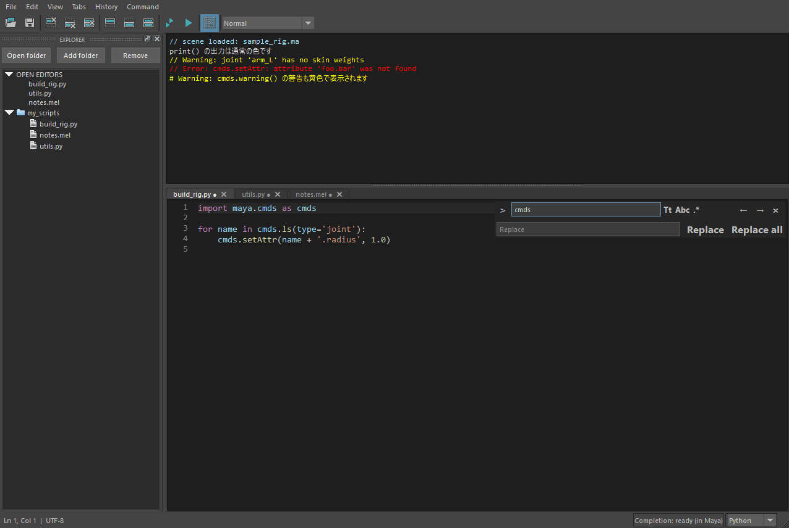

基本の使い方
============

.. figure:: _static/images/main.png
   :alt: hedit の全体。上段が出力欄、下段がコード欄、左が Explorer
   :width: 100%

   hedit の画面。上段が出力欄(種別ごとに色分け)、下段がコード欄、左が Explorer です。

コードを実行する
----------------

.. list-table::
   :header-rows: 1
   :widths: 30 25 45

   * - 操作
     - キー
     - 動作
   * - 選択範囲を実行
     - Ctrl+Enter(テンキーの Enter も可)
     - 選択した部分だけ実行。\ **選択がなければタブ全体** を実行(カーソル行だけではありません)
   * - タブ全体を実行
     - F5(Command → Run all)
     - 選択に関係なく、タブ全体を実行
   * - 現在行を選択
     - Ctrl+L
     - 選択してから Ctrl+Enter で、その行だけ実行できる

* 通常の Enter は改行です。実行後も、コードと選択範囲はそのまま残ります。
* 選択した文字列を、そのまま Python として実行します。関数や ``for`` 文などは、必要なブロック全体を選択してください。
  インデントの自動除去や、足りない文の補完はしません。
* MEL タブでは、MEL として実行します(標準スクリプトエディターの全機能の再現ではありません)。
* 保存済みのタブ(ファイルを開いた・保存したタブ)を実行すると、実行中だけ ``__file__`` がそのファイルのパスになり、
  実行後は元の値に戻ります(スクリプトが自分の場所を基準にファイルを読めるように。Maya 標準のスクリプトエディターには無い補助です)。
  ``__name__`` は ``__main__`` のままで、相対 import はできません。
* Maya 標準のスクリプトエディターの「選択して Ctrl+Enter」に合わせた操作です。VS Code の「下に行を挿入」とは違い、
  hedit では Ctrl+Enter は実行です。
* 実行はメインスレッドで行うため、長い処理の間は Maya が待機します。

タブとファイル
--------------

.. list-table::
   :header-rows: 1
   :widths: 35 65

   * - 操作
     - 内容
   * - File → New Python tab(Ctrl+N)
     - Python のタブを作る
   * - File → New MEL tab
     - MEL のタブを作る
   * - 右下の Python / MEL
     - 現在のタブの言語を切り替える(自動復元にも保存されます)
   * - File → Open…(Ctrl+O)
     - ``.py`` / ``.mel`` ファイルを開く
   * - File → Save(Ctrl+S)/ Save as…(Ctrl+Shift+S)
     - UTF-8 で保存。元のファイルは一時ファイル経由で置き換えるため、書き込みに失敗しても壊れません
   * - タブの × / Ctrl+W / Ctrl+F4
     - タブを閉じる。\ **未保存なら保存確認** が出る。最後のタブを閉じると空のタブが 1 つ作られる
   * - Ctrl+Tab / Ctrl+Shift+Tab(Ctrl+PgDown / Ctrl+PgUp)
     - 次 / 前のタブ(先頭と末尾で折り返す)
   * - タブ上のマウスホイール
     - 隣のタブへ移動。タブが収まらない場合は左右にスクロールボタンが出る

* ファイルは UTF-8 です。タブの見出しの「●」は、未保存の変更があることを示します。
* 保存時の行末空白の削除・末尾改行の補完は、設定で有効にできます(:ref:`pref-trimWhitespace`\ ・\ :ref:`pref-finalNewline`)。

Explorer(フォルダーツリー)
----------------------------

左側のサイドバーで、フォルダーとその中の ``.py`` / ``.mel`` ファイルを一覧します。

.. list-table::
   :header-rows: 1
   :widths: 35 65

   * - 操作
     - 内容
   * - File → Open folder…
     - Explorer のルートを **置き換える**
   * - File → Add folder…
     - ルートを **追加する**\ (複数のフォルダーを並べられる)
   * - ファイルをダブルクリック
     - タブで開く
   * - Remove
     - 表示するルートから外す。 **ディスクからは削除しません**
   * - View → Explorer / ツールバー / Ctrl+B
     - サイドバーの表示・非表示

* 保存済みのファイルを開くと、その親フォルダーと OPEN EDITORS に表示します。
* フォルダーは展開したときに直下だけを、別スレッドで読みます(読んでいる間も入力できます)。
* シンボリックリンク、\ ``__pycache__``\ ・\ ``.git`` フォルダーは表示しません。
* フォルダーの一覧と表示状態も、タブと一緒に復元します(:doc:`session`)。

.. _usage-find:

検索と置換
----------

**Ctrl+F** で検索、\ **Ctrl+H** で置換のバーを、コード欄の右上に重ねて表示します。
対象は **現在のタブの中** です。

   Ctrl+H で開いた検索・置換バー。

バーの配置・大きさ・アイコン・動きは VS Code の検索ウィジェットに合わせています。色は hedit の配色、
入力欄と件数の文字はエディターと同じフォント・大きさです(Ctrl+= / Ctrl+- の文字サイズに追従します)。
アイコンは ``hedit.mll`` の中で描いているため、画像ファイルは使いません。

* 検索欄に 1 文字入力するごとに、一致箇所と件数を更新します(Enter は不要)。空欄にすると選択と件数表示を解除します。
* 本文の中の全ての一致箇所に、薄い茶色の背景を付けます(選択中の一致は選択の色)。本文を編集したり、
  タブを切り替えたりしたときも、件数と背景を更新します。バーを閉じると背景は消えます。
* 入力中の欄だけ、枠を青く表示します。
* Enter / F3 / ``↓`` で次の一致、Shift+Enter / Shift+F3 / ``↑`` で前の一致へ移動します。末尾と先頭で折り返します。
* 検索欄の右に「1 of 4」のように件数を表示します。選択が一致箇所でなければ「? of 4」、一致が無ければ **赤い**
  「No results」です。不正な正規表現のときは、検索欄の枠を赤くし、欄の真下に理由の吹き出しを出します。
* Escape または ``×`` でバーを閉じてコードへ戻ります。
* 検索欄の中の切り替えボタン(初期状態はすべてオフ。オンのときは青い背景と枠で表示):

  .. list-table::
     :widths: 15 85

     * - ``Aa``
       - 大文字小文字を区別する
     * - ``ab``\ (下に括弧)
       - 単語単位で一致させる
     * - ``.*``
       - 正規表現(Qt の ``QRegularExpression`` 方式)

* ``↓`` の右の三本線のボタンは **選択範囲内で検索** です。オンにした時点の選択範囲の中だけを数え、移動・置換します
  (範囲は本文を編集しても一緒に動きます)。選択が無いときはオンになりません。
* 置換欄は、左端の ``›``\ (開くと ``⌄``\ )または Ctrl+H で開きます。検索欄の真下に同じ幅で表示します。
  置換欄の右の **置換** ボタン(置換欄で Enter でも同じ)は選択中の一致、\ **すべて置換** ボタンは現在のタブ全体
  (選択範囲内で検索がオンならその範囲)を置換します。一括置換は **1 回の Undo** で元に戻せます。
* 置換欄の中の ``AB`` をオンにすると、一致した文字列の大文字小文字の形を保って置換します
  (``cmds`` → ``hlib``\ 、\ ``CMDS`` → ``HLIB``\ 、\ ``Cmds`` → ``Hlib``\ )。
* 正規表現モードの置換では ``$1``\ 〜\ ``$99`` がキャプチャー、\ ``$&`` が一致全体、\ ``$$`` がドル記号です。
  通常モードは入力した文字をそのまま使います。名前付きの参照や ```` の書き方には対応していません。
* 不正な正規表現、長さ 0 の一致、10 万件を超える一致は、通知して処理を止めます(置換はしません)。

指定行へ移動(Ctrl+G)
----------------------

操作したいコード欄または出力欄をクリックして Ctrl+G を押すと、下部に行番号の入力欄が開きます。
1 から始まる行番号を入力して Enter で移動、Esc で取り消します。

* 出力欄の行番号が非表示でも使えます(:ref:`pref-outputLineNumbers`)。
* Maya 2024 では、Esc の後にフォーカスがビューポートへ戻ることがあります。その場合は、コード欄か出力欄をクリックして続けてください。

出力欄の操作
------------

* 出力欄は読み取り専用です。マウスや Shift+矢印で選択し、Ctrl+C でコピーできます。Ctrl+A で全選択、右クリックの Copy も使えます。
* **Clear output** は出力欄を右クリック、または History メニュー・ツールバーから行えます。出力のクリアは元に戻せません。
  「入力の消去」(Edit → Clear input)は Ctrl+Z で戻せます。
* ログの追記中も、選択範囲とスクロール位置を保ちます。選択がなく末尾を見ているときだけ、新しいログへ追従します。

詳しくは :doc:`output` を参照してください。

表示の切り替え(ツールバー・View メニュー)
-------------------------------------------

.. list-table::
   :header-rows: 1
   :widths: 35 65

   * - View メニュー
     - 内容
   * - Show input and output
     - 出力欄とコード欄の両方を表示する
   * - Show output only
     - 出力欄だけを表示する
   * - Show input only
     - コード欄だけを表示する
   * - Explorer
     - サイドバーの表示・非表示(Ctrl+B)
   * - Zoom in / Zoom out / Reset zoom
     - 文字サイズ(:doc:`preferences` の「文字サイズ(Zoom)」を参照)

ツールバーは Maya 標準のスクリプトエディターと同じく、アイコン中心です(開く・保存、出力/入力/両方の消去、
表示の切り替え、全体実行/選択実行、Explorer)。マウスを重ねると操作名とショートカットを表示します。
すべての操作は File・Edit・View・Tabs・History・Command メニューからも選べます。
