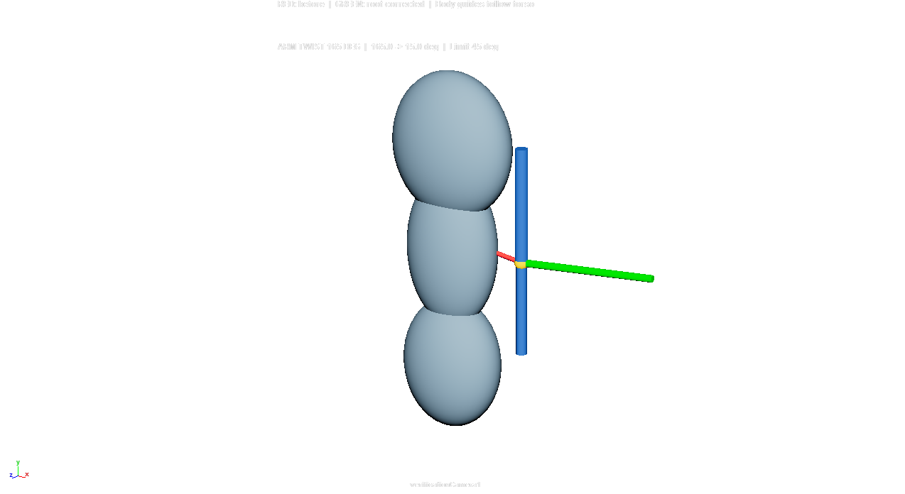
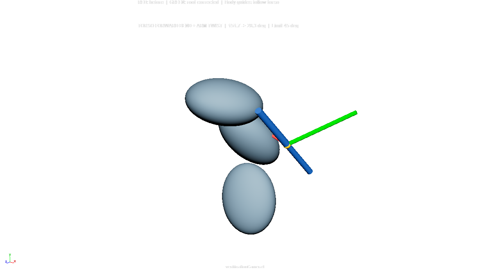
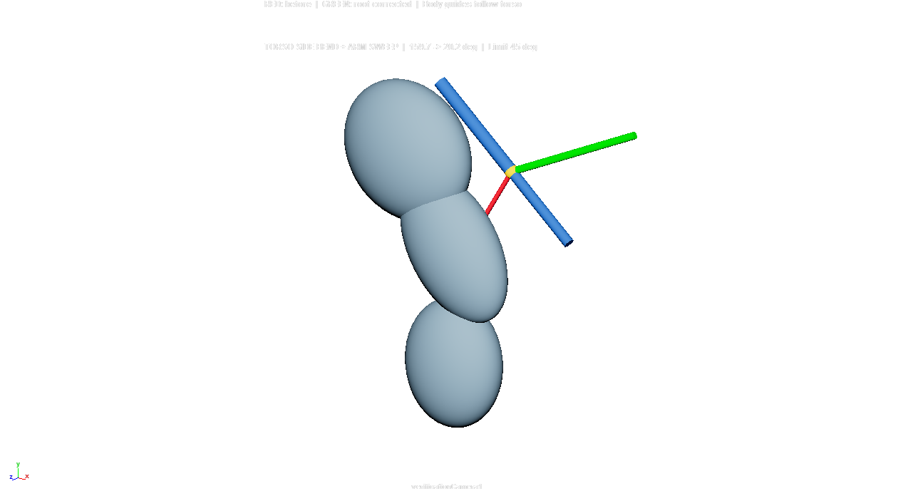

根元の方向制限
==============

``RootDirectionLimit`` は、現在の胴体参照から外向き方向を計算し、
尻尾の根元の回転を許容cone内へ制限します。
登録ポーズ、RBF、メッシュ検索、コリジョン、実行時Pythonは使用しません。
評価はMaya標準DGノードだけで行います。

使い方
------

未補正の取付位置・向きを持つ参照と、骨盤から胸の順のguideを用意します。
各guideのY軸は胴体の縦方向、X軸は径方向を求められない場合の優先方向です。
左右のリグでは、対応する側へguideのX軸を向けてください。

.. code-block:: python

   from hrig.setups import RootDirectionLimit

   setup = RootDirectionLimit.create(
       "tailSocket_REF",
       ["pelvis_REF", "abdomen_REF", "chest_REF"],
       name="elbowTailAvoid",
       angle=45.0,
       softness=0.02,
       aimAxis="x",
       upAxis="y",
       bodyUpAxis="y",
       bodySideAxis="x",
   )

   # angleは表示単位に関係なく度。container上でキー設定も可能。
   setup.container.getPlug("angle").set(50.0)
   output = setup.output

``output`` はsourceの位置と一様scaleへ追従する新規Transformです。
identity TRS・jointOrientゼロの根元骨の親として使用します。
下流骨のローカル位置・回転はそのまま利用できます。

.. code-block:: text

   tailSocket_REF        未補正の入力（outputから独立）
   pelvis/abdomen/chest  現在の胴体へ追従する入力

   elbowTailAvoid_output 計算した取付位置・根元の向き
       tailRoot_JNT     identity TRS、jointOrientゼロ
           tailTip_JNT  元のローカル位置・回転

既存の骨、接続、階層はcreateでは変更しません。
スキン済みの既存骨への接続・階層移動は、この使用例では扱いません。
sourceまたはguideをoutputの子孫にすると循環するため、入力と出力を分けます。
根元にも手付けや揺れを加える場合は、source側へ合成してから制限してください。

保存したシーンではmessage接続から出力参照を取り直せます。

.. code-block:: python

   setup = RootDirectionLimit("elbowTailAvoid")

設定
----

* ``angle``: cone半角。1〜89度。小さいほど外側へ強く制限します。
* ``softness``: 境界のsmooth max幅。単位なし、0〜0.2。
* ``aimAxis`` / ``upAxis``: 出力の長手軸・roll基準軸。異なる軸を指定します。
* ``bodyUpAxis`` / ``bodySideAxis``: guideの縦軸・代替側軸。異なる軸を指定します。
* 各軸は ``x/y/z/-x/-y/-z`` に対応します。
* guideは2個以上、初期の隣接位置は1e-3cm以上離してください。

初期scaleは正の一様scale、shearなしが必要です。
構築後も負scale・非一様scale・shearは対象外です。
生成物はcontainerへ所属し、構築全体を1回のUndo/Redoで扱えます。

計算と胴体の曲げ
----------------

最初のguideの空間で、各guideに対する根元の縦方向位置から連続した重みを作り、
局所胴体中心と縦方向を補間します。胸1個への固定ではなく、腹・骨盤の変化も入力になります。
胴体軸に直交する、中心から根元への方向を外向き軸とします。
径方向がゼロの場合はguideの側軸を、guide軸が縮退した場合は代替軸を使用します。

内積で根元の候補方向を分解し、外向きcone内へ直接戻します。
真逆付近は軸成分を外側へ反射するため、180度の狭い領域で向きが急変することを抑えます。
cone条件は、単位方向同士の内積が半角のcos以上になることです。
rollは局所胴体のupを基準にします。腕のrollをそのまま保持する機能ではありません。

``container.matrix`` はワールド行列です。
``center``、``bodyUp``、``outward``、``direction`` は最初のguide空間の診断出力です。
``center`` の距離はその参照空間のcm、他のvectorは単位方向です。
``inputDot`` と ``resultDot`` は補正前後の外向き軸との内積です。
3guideの既定構成では、出力Transformを含め147メンバーを生成します。
負荷はguide数・演算ノード数に依存し、胴体の頂点を走査しません。

検証結果
--------

2026-10-10にMaya2025・2027の隔離standaloneで各10テストが成功しました。
ランダム姿勢165条件、体曲げ41条件、180度付近501サンプル、
ゼロ径方向・guide縮退、表示単位、符号付き6軸、角度編集、
DG/Serial/Parallelと任意フレームジャンプ、Undo/Redo、保存再読込を確認しています。
安全範囲内で元の長手方向を維持することも検査します。

Maya2027 GUIでは、簡易胴体メッシュと腕・根元1骨・末端1骨を作成しました。
根元位置の誤差は全4姿勢で0cm、末端骨のローカル位置/回転は維持されました。
検証時だけMFnMeshで尻尾の中心線6cmと実メッシュの交差を確認しました。
これは独立した検証処理であり、リグの評価には含めていません。

.. list-table:: GUIでの方向と中心線の交差
   :header-rows: 1

   * - 姿勢
     - 補正前角度
     - 補正後角度
     - 補正前の交差
     - 補正後の交差
   * - ニュートラル
     - 0.0度
     - 0.0度
     - なし
     - なし
   * - 腕の捻り
     - 165.0度
     - 15.0度
     - 腹部
     - なし
   * - 前屈＋腕の捻り
     - 151.7度
     - 28.3度
     - 腹部
     - なし
   * - 側屈＋腕の移動
     - 159.7度
     - 20.2度
     - 腹部
     - なし

画像はMayaの実viewportを撮影したものです。赤は未補正、緑は根元補正後です。

再実行
------

単体検証は、ユーザー設定を隔離した専用mayapyで実行します。
GUI内へ単体テストを送信すると新規シーンへ切り替わるため、使用しないでください。

.. code-block:: powershell

   $env:MAYA_APP_DIR = "$PWD/.maya-output/root-limit-test-app"
   $env:MAYA_SKIP_USERSETUP_PY = '1'
   & 'C:/Program Files/Autodesk/Maya2027/bin/mayapy.exe' tools/verify_root_direction_limit.py

``tools/test_rig_packages.py --suite setups`` / ``--suite all`` にも登録しています。
``tools/demo_root_direction_limit.py`` は新規シーンを作るGUI専用デモです。
保存・撮影先は ``.maya-output/root-limit-gui`` です。作業中のシーンには送信しないでください。

制限
----

これは骨格参照の方向制限で、実際の体表面を表現するものではありません。
任意の体型・衣服・極端な折返し・太い尻尾の全頂点での非貫通は保証しません。
取付点自体が体内へ入る姿勢も、回転だけでは解決しません。
guideが縮退する場合の代替軸の切替では、連続性が失われる可能性があります。
実キャラクター、長い再生、性能比較、他バージョンのGUIは未検証です。
